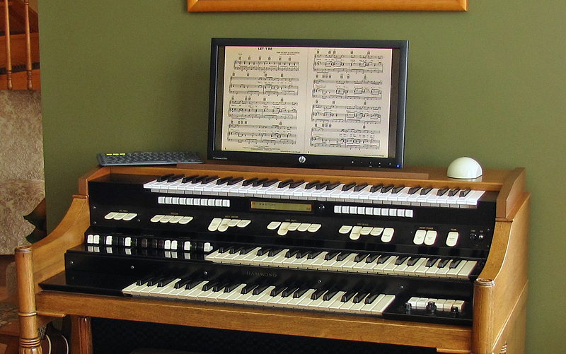
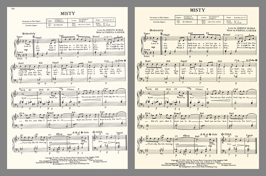
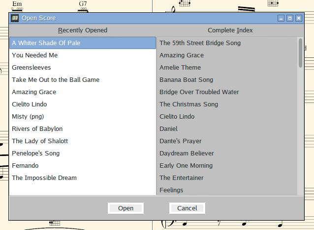
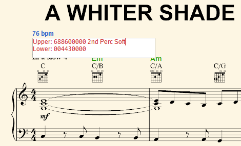
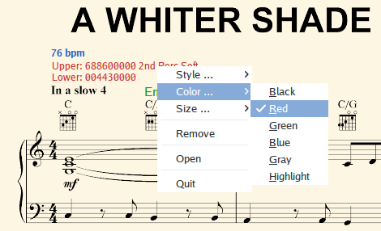

# MusicRack - A Digital Sheet Music Display System

MusicRack is a simple yet flexible digital sheet music display system developed
for the Raspberry Pi, which can also be built on other Linux systems, and
probably Mac and Windows too. The main application is implemented in
Lazarus/FreePascal, and the image processing engine used to prepare music for
display is written in C.

To keep things as simple as possible, there are no command line options, no
settings dialog, and no configuration file.

## System Requirements

MusicRack is intended to work on a widescreen (e.g. 16:10 or 16:9) monitor,
displaying two pages at once.

MusicRack uses the following libraries and utilities, or newer versions thereof:

* libjpeg
* libpng12-0
* libtiff5
* zlib1g
* GhostScript 9.26

If you are building MusicRack from source, you will need the following tools
and libraries, or newer versions thereof:

* To recompile the MusicRack application:
    * Lazarus 1.6.2
    * Free Pascal 3.0.0
* To recompile the score preparation utility:
    * GCC 4.9.2
    * libjpeg-dev
    * libpng12-dev
    * libtiff5-dev
    * zlib1g-dev

## Score Files

By default, MusicRack expects to find all score files in `$HOME/SheetMusic`, or
subdirectories thereof. Scores can be provided as PDF, BMP, JPEG, PNG, or TIFF
files. If MusicRack is invoked with one or more command line arguments, they
are interpreted as directory names in which to search for scores _instead of_
`$HOME/SheetMusic`.

There is no index file or database that maps song titles to score files. The
name of the score file itself minus the file extension, is used as the title.
Any sequence of one or more spaces or underscores in the file name is replaced
by a single space when MusicRack displays the title.

For multi-page scores provided as images (BMP, JPEG, PNG, or TIFF), a separate
file is needed for each page. These files should all have the same name, except
for a suffix beginning with `-` and followed by one or more digits. There
should be no leading zeros on the suffixes.

A score in PDF format may optionally have one or two suffixes, each beginning
with a `+` or `-` character, followed by one or more digits. These indicate the
number of pages to skip at the beginning of the score when first opening it or
pressing Home or a page number key, and the number of pages to stop short of
the end of the score when pressing the End key. This is useful for skipping
cover pages, end notes, etc. The skipped pages are still reachable using the
other navigation keys.

### The Score Preparation Process

The first time a score is opened for display, MusicRack will prepare the score
for display. If the score is in PDF format, it will first be split into
separate pages.

For each page of the score, MusicRack will produce pre-scaled image files
suitable for fast display on your monitor. These will be saved in a
subdirectory with a name of the form `.WxH`, where _W_ is half the screen width
in pixels and _H_ is the screen height. For example, on a 1920x1080 screen, the
subdirectory is named `.960x1080`. When a score is opened subsequently, the
saved images will be used (unless the original files have been updated).

The pre-scaling process is performed by MusicRack's `muprep` utility, which
will also attempt to optimize each page for display. This includes conversion
to greyscale, black and white level correction, trimming whitespace from the
edges, and straightening scanned scores that are skewed by as much as two
degrees. The resulting images are written out as colour-mapped PNG files using
an off-white background colour to be easy on the eyes. For more details, please
refer to [muprep's documentation](MuPrep/README.md).

Unfortunately, MusicRack can't fix everything. In the case of a scanned score,
the scan should already have been cropped by hand to remove visible paper
edges and bindings. For best results, a scan should be at 300dpi or higher.

## Selecting a Score

To open a new score, press the "O" key, or right click anywhere and select
"Open" from the popup menu. This will display the score selection dialog box.

The left side of the dialog shows the most recently selected scores, with the
most recent at the top of the list. The right side lists all the scores that
MusicRack knows about, sorted alphabetically (ignoring leading words "A", "An",
or "The").

## Navigating Through a Score

Navigation through a score is done by keyboard shortcuts, since no one wants
to stop playing to pick up a mouse. If you have a touchscreen, or really want
to use that mouse, there are also gestures for the most common operations.

Operation         | Letter Key | Alternate Keys         | Gesture
------------------|------------|------------------------|------------
Back one page     | L          | Backspace, LeftArrow   | Swipe right
Forward one page  | R          | Space, Tab, RightArrow | Swipe left
Back two pages    | U          | PageUp, UpArrow        | Swipe down
Forward two pages | D          | PageDown, DownArrow    | Swipe up
First page        | H          | Home                   |
Last page         | E          | End                    |
Specific page     | 1 to 9, 0  | F1 to F24              |
Open score list   | O          |                        |
Quit              | Ctrl+Q     |                        |

When performing a swipe operation, be careful not to start on an annotation, as
this will move the annotation instead of changing pages.

## Annotations

Musicians like to write stuff on their sheet music, so MusicRack lets you add
annotations to your scores. Unlike paper sheet music, the actual scores are not
defaced. The annotations are stored separately (in the `.annotations`
subdirectory of the directory containing the score), and drawn over top of the
page they belong to when the page is displayed.

To create an annotation anywhere on a page, click the left mouse button at the
desired location. This will open a multi-line edit field into which you can
type. When done, press the `Esc` key to close the edit field.

An existing annotation can be edited by clicking on it. This will reopen the
edit field. Once again, pressing `Esc` will close the edit field.

Annotations rarely end up exactly where you want them, so they can be moved by
clicking and dragging. An annotation can be dragged anywhere on the page
that it belongs to (it can't be dragged to another page).

Right clicking on an annotation (while it is _not_ open for editing) will
display a popup menu of formatting options:

* Style: any combination of bold, italic, underlined, and strikethrough
* Color: any one of black, red, green, blue, gray, or highlight
* Size: any one of small, medium, large, subtitle, or title

The selected formatting applies to the entire annotation. There is no facility
for individually formatting words therein.

An annotation can be removed by selecting Remove from the popup menu.

## Controlling MusicRack with Raspberry Pi GPIO Inputs

The original intention was to include support for manipulating MusicRack with
GPIO inputs on the Raspberry Pi, to make it easy to connect dedicated page
turning buttons or foot pedals for example. For various reasons, this proved
troublesome, and it was decided to write a separate GPIO-to-Keypress utility,
<https://github.com/svorkoetter/GPIOKey>, that is independent of MusicRack
(and thus usable with other applications too).
